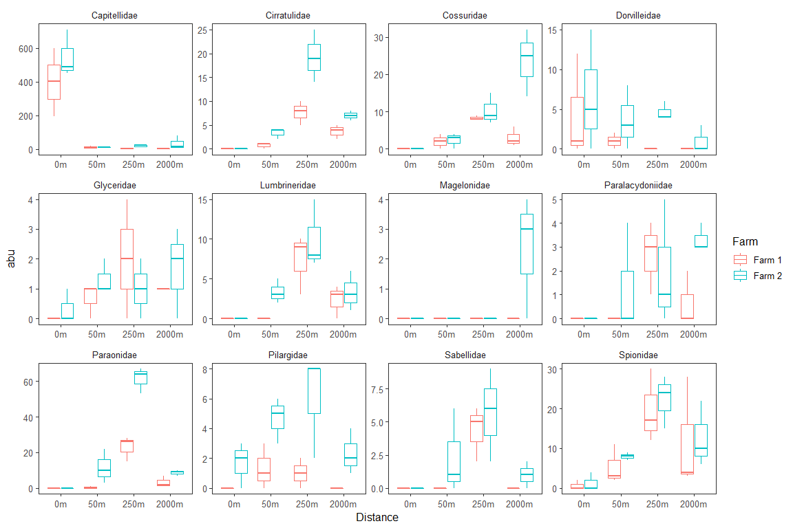
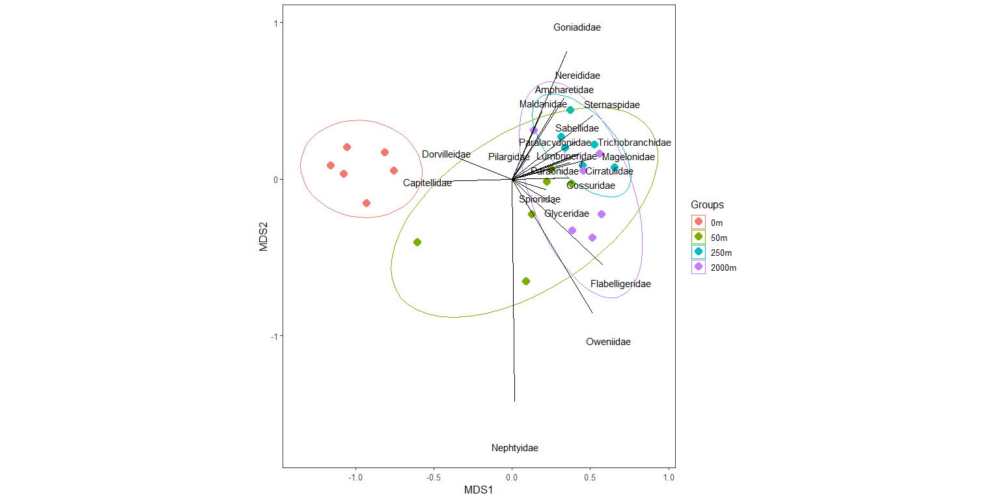
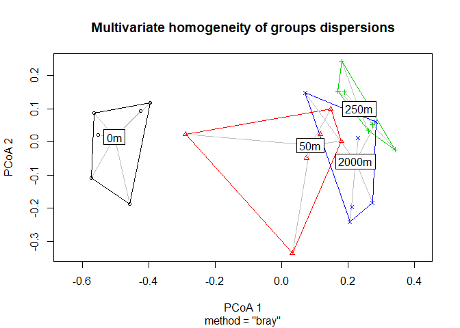
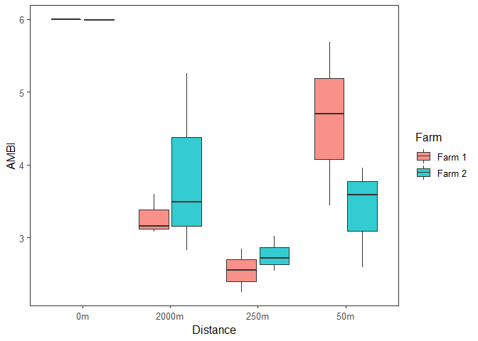
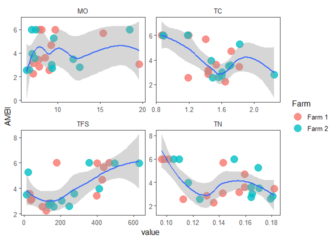
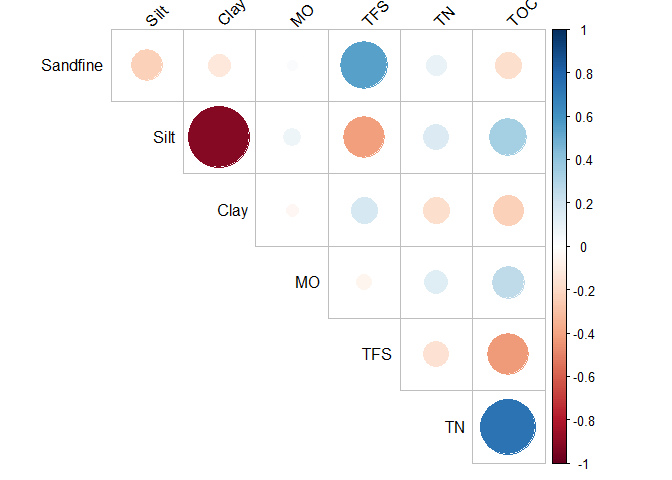
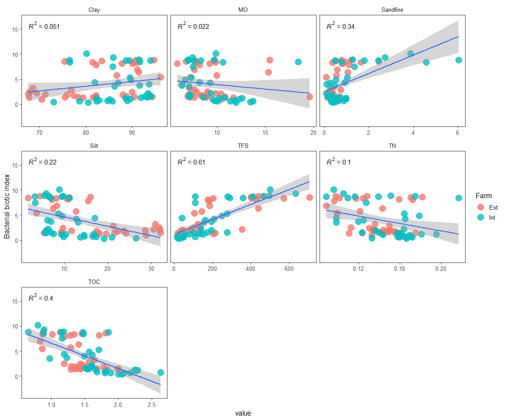
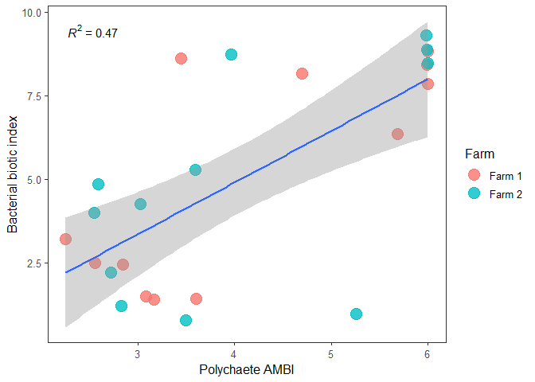
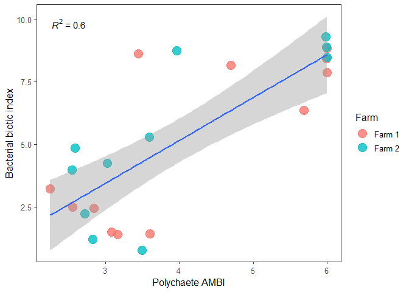

## 01 Load libraries and data


```r
library(tidyverse)
library(ggpubr)
library(vegan)
library(ggord)
library(ggpmisc)
library(readxl)
library(knitr)
library(pairwiseAdonis)
library(benthos)
library(corrplot)

source('theme_javier.R')
theme_set(theme_javier())

# polychaetes data
poli <- 
  read_excel('data/poliquetos.xlsx', 2) %>% 
  mutate(Distance = fct_relevel(Distance, "0m" , "50m", "250m", "2000m"),
         Farm = fct_recode(Farm, `Farm 1` = "Ext", `Farm 2` = "Int"))

# sediment environmental data
env <- 
  read_excel('data/poliquetos.xlsx', 1) %>% 
  select(SampleID, TN, TC, MO, TFS)
```


## 02 Plot 12 most abundant families

```r
poli_long <- 
  poli %>% 
  gather(taxa, abu, Capitellidae:Nephtyidae) 

top_taxa <- 
  poli_long %>% 
  group_by(taxa) %>% 
  summarise_at(vars(abu), funs(sum), na.rm =T) %>%
  top_n(12) %>% 
  dplyr::select(taxa) %>% 
  as.list()
```

```
## Warning: funs() is soft deprecated as of dplyr 0.8.0
## Please use a list of either functions or lambdas: 
## 
##   # Simple named list: 
##   list(mean = mean, median = median)
## 
##   # Auto named with `tibble::lst()`: 
##   tibble::lst(mean, median)
## 
##   # Using lambdas
##   list(~ mean(., trim = .2), ~ median(., na.rm = TRUE))
## This warning is displayed once per session.
```

```
## Selecting by abu
```

```r
poli_long %>%
  filter(taxa %in% top_taxa$taxa) %>% 
  ggplot() +
  geom_boxplot(aes(Distance, abu, color = Farm)) +
  facet_wrap( ~ taxa, scales = 'free', nrow = 3)
```

<!-- -->

## 03 nMDS plot 

```r
# 04 MDS ordination -------------
mds <- metaMDS( sqrt(sqrt(poli[, -c(1:5)])) , distance = 'bray',)
```

```
## Run 0 stress 0.0804792 
## Run 1 stress 0.1208583 
## Run 2 stress 0.08125625 
## Run 3 stress 0.081816 
## Run 4 stress 0.08042585 
## ... New best solution
## ... Procrustes: rmse 0.006229355  max resid 0.02275554 
## Run 5 stress 0.0834672 
## Run 6 stress 0.08045394 
## ... Procrustes: rmse 0.003223932  max resid 0.01119658 
## Run 7 stress 0.08125616 
## Run 8 stress 0.1211199 
## Run 9 stress 0.08047786 
## ... Procrustes: rmse 0.006213462  max resid 0.02267709 
## Run 10 stress 0.08181599 
## Run 11 stress 0.08047779 
## ... Procrustes: rmse 0.006218731  max resid 0.02267274 
## Run 12 stress 0.129794 
## Run 13 stress 0.08045119 
## ... Procrustes: rmse 0.002878267  max resid 0.009971872 
## ... Similar to previous best
## Run 14 stress 0.1303956 
## Run 15 stress 0.0834672 
## Run 16 stress 0.1215674 
## Run 17 stress 0.08223418 
## Run 18 stress 0.1208584 
## Run 19 stress 0.08047832 
## ... Procrustes: rmse 0.006221027  max resid 0.02271036 
## Run 20 stress 0.08181599 
## *** Solution reached
```

```r
## MDS biplot 
ggord(
  mds,
  grp_in = poli$Distance,
  poly = F,
  alpha = 1,
  ellipse = T,
  arrow = 0,
  repel = T,
  text = .01,
  vec_ext = .7
) +
  theme_javier()
```

<!-- -->


## 03 PERMANOVA and SIMPER


```r
permanova <-
  adonis(
    sqrt(sqrt(poli[,-c(1:5)])) ~ Distance * Farm,
    method = 'bray',
    permutations = 9999,
    data = poli
  )

permanova
```

```
## 
## Call:
## adonis(formula = sqrt(sqrt(poli[, -c(1:5)])) ~ Distance * Farm,      data = poli, permutations = 9999, method = "bray") 
## 
## Permutation: free
## Number of permutations: 9999
## 
## Terms added sequentially (first to last)
## 
##               Df SumsOfSqs MeanSqs F.Model      R2 Pr(>F)    
## Distance       3    2.3760 0.79200 21.9170 0.71424 0.0001 ***
## Farm           1    0.1875 0.18745  5.1873 0.05635 0.0168 *  
## Distance:Farm  3    0.1850 0.06166  1.7063 0.05560 0.1507    
## Residuals     16    0.5782 0.03614         0.17381           
## Total         23    3.3266                 1.00000           
## ---
## Signif. codes:  0 '***' 0.001 '**' 0.01 '*' 0.05 '.' 0.1 ' ' 1
```

```r
# pairwise comparisons-------------
pairwise.adonis(
  sqrt(sqrt(poli[,-c(1:5)])),
  poli$Distance)
```

```
##           pairs Df SumsOfSqs   F.Model        R2 p.value p.adjusted sig
## 1     0m vs 50m  1 0.9709690 17.913217 0.6417468   0.001      0.006   *
## 2    0m vs 250m  1 1.6477067 58.039808 0.8530272   0.001      0.006   *
## 3   0m vs 2000m  1 1.5316848 33.213406 0.7685903   0.006      0.036   .
## 4   50m vs 250m  1 0.2932122  5.990758 0.3746388   0.002      0.012   .
## 5  50m vs 2000m  1 0.1806801  2.710014 0.2132188   0.028      0.168    
## 6 250m vs 2000m  1 0.1277467  3.126717 0.2381949   0.025      0.150
```

```r
# SIMPER ---------------
simp_distance <- simper(sqrt(sqrt(poli[, -c(1:5)])), poli$Distance, permutations = 999)
simp_Farm <- simper(sqrt(sqrt(poli[, -c(1:5)])), poli$Farm, permutations = 999)


simper_dist_table <- 
  bind_rows("0m vs. 50m" = simp_distance$`0m_50m` %>% data.frame(),
            "0m vs 250m" = simp_distance$`0m_250m` %>% data.frame(),
            "0m vs 2000m" = simp_distance$`0m_2000m` %>% data.frame(),
          "50m vs 250m" = simp_distance$`50m_250m` %>% data.frame(),
          "50m vs. 2000m" = simp_distance$`50m_2000m` %>% data.frame(),
          "250m vs 2000m" = simp_distance$`250m_2000m` %>% data.frame(),
            .id = "Groups") %>% 
  dplyr::select(-overall, -ord) %>% 
  dplyr::filter(cusum<.7) %>% 
  rename(Family = "species")
  
kable(simper_dist_table, digits = 2,caption = "SIMPER table among distances")
```


Table: SIMPER table among distances

Groups          Family           average     sd   ratio    ava    avb   cusum      p
--------------  --------------  --------  -----  ------  -----  -----  ------  -----
0m vs. 50m      Capitellidae        0.17   0.04    4.04   4.60   1.73    0.28   0.00
0m vs. 50m      Spionidae           0.07   0.04    1.72   0.43   1.56    0.39   0.00
0m vs. 50m      Paraonidae          0.05   0.04    1.31   0.00   1.04    0.48   0.23
0m vs. 50m      Dorvilleidae        0.05   0.04    1.31   1.05   0.86    0.56   0.03
0m vs. 50m      Cossuridae          0.05   0.04    1.30   0.00   0.89    0.64   0.06
0m vs 250m      Capitellidae        0.12   0.03    3.51   4.60   1.71    0.16   0.00
0m vs 250m      Spionidae           0.07   0.03    2.37   0.43   2.12    0.29   0.00
0m vs 250m      Paraonidae          0.10   0.01   10.71   0.00   2.49    0.38   0.00
0m vs 250m      Dorvilleidae        0.04   0.03    1.20   1.05   0.73    0.48   0.58
0m vs 250m      Cossuridae          0.07   0.01    8.28   0.00   1.74    0.57   0.00
0m vs 250m      Cirratulidae        0.08   0.01   10.42   0.00   1.87    0.66   0.00
0m vs 2000m     Capitellidae        0.15   0.06    2.50   4.60   1.65    0.20   0.00
0m vs 2000m     Spionidae           0.07   0.04    1.70   0.43   1.76    0.31   0.00
0m vs 2000m     Paraonidae          0.07   0.01    6.06   0.00   1.49    0.41   0.01
0m vs 2000m     Dorvilleidae        0.05   0.04    1.23   1.05   0.22    0.51   0.05
0m vs 2000m     Cossuridae          0.08   0.02    5.12   0.00   1.72    0.60   0.00
0m vs 2000m     Cirratulidae        0.07   0.01    6.61   0.00   1.50    0.67   0.00
50m vs 250m     Capitellidae        0.01   0.01    1.26   1.73   1.71    0.14   1.00
50m vs 250m     Spionidae           0.02   0.01    1.59   1.56   2.12    0.24   0.95
50m vs 250m     Paraonidae          0.05   0.04    1.47   1.04   2.49    0.34   0.20
50m vs 250m     Dorvilleidae        0.03   0.02    1.23   0.86   0.73    0.43   0.96
50m vs 250m     Cossuridae          0.03   0.03    1.19   0.89   1.74    0.51   0.97
50m vs 250m     Cirratulidae        0.03   0.02    1.34   1.00   1.87    0.59   0.87
50m vs 250m     Lumbrineridae       0.04   0.03    1.35   0.67   1.68    0.66   0.23
50m vs. 2000m   Capitellidae        0.03   0.02    1.40   1.73   1.65    0.10   0.99
50m vs. 2000m   Spionidae           0.02   0.01    1.17   1.56   1.76    0.19   0.97
50m vs. 2000m   Paraonidae          0.04   0.03    1.21   1.04   1.49    0.28   0.99
50m vs. 2000m   Dorvilleidae        0.03   0.03    1.26   0.86   0.22    0.37   0.68
50m vs. 2000m   Cossuridae          0.04   0.03    1.28   0.89   1.72    0.46   0.65
50m vs. 2000m   Cirratulidae        0.02   0.03    0.90   1.00   1.50    0.54   0.98
50m vs. 2000m   Lumbrineridae       0.03   0.03    1.07   0.67   1.10    0.61   0.72
50m vs. 2000m   Glyceridae          0.02   0.02    0.74   0.86   0.92    0.67   0.98
250m vs 2000m   Capitellidae        0.02   0.01    1.45   1.71   1.65    0.11   1.00
250m vs 2000m   Spionidae           0.02   0.01    1.43   2.12   1.76    0.21   0.99
250m vs 2000m   Paraonidae          0.03   0.02    2.02   2.49   1.49    0.29   0.99
250m vs 2000m   Dorvilleidae        0.02   0.02    0.99   0.73   0.22    0.36   0.99
250m vs 2000m   Cossuridae          0.01   0.01    1.87   1.74   1.72    0.42   1.00
250m vs 2000m   Cirratulidae        0.01   0.01    1.41   1.87   1.50    0.48   1.00
250m vs 2000m   Lumbrineridae       0.02   0.02    1.04   1.68   1.10    0.54   1.00
250m vs 2000m   Glyceridae          0.02   0.02    1.09   0.80   0.92    0.60   0.99
250m vs 2000m   Pilargidae          0.03   0.02    1.25   1.12   0.60    0.65   0.95

## 04 PERMDIST Multivariate homogeneity of groups dispersions

```r
dis <- vegdist(sqrt(sqrt(poli[, -c(1:5)])))
beta_disp <-
  betadisper(
    dis, poli$Distance
  )
```

```
## Warning in betadisper(dis, poli$Distance): some squared distances are negative
## and changed to zero
```

```r
beta_disp
```

```
## 
## 	Homogeneity of multivariate dispersions
## 
## Call: betadisper(d = dis, group = poli$Distance)
## 
## No. of Positive Eigenvalues: 13
## No. of Negative Eigenvalues: 10
## 
## Average distance to median:
##     0m    50m   250m  2000m 
## 0.1598 0.2135 0.1334 0.2161 
## 
## Eigenvalues for PCoA axes:
## (Showing 8 of 23 eigenvalues)
##   PCoA1   PCoA2   PCoA3   PCoA4   PCoA5   PCoA6   PCoA7   PCoA8 
## 2.31922 0.47072 0.31873 0.15357 0.11520 0.09259 0.06986 0.05349
```

```r
anova(beta_disp)
```

```
## Analysis of Variance Table
## 
## Response: Distances
##           Df   Sum Sq   Mean Sq F value Pr(>F)
## Groups     3 0.030015 0.0100051  1.1843 0.3408
## Residuals 20 0.168968 0.0084484
```

```r
permutest(beta_disp, pairwise = TRUE, permutations = 999)
```

```
## 
## Permutation test for homogeneity of multivariate dispersions
## Permutation: free
## Number of permutations: 999
## 
## Response: Distances
##           Df   Sum Sq   Mean Sq      F N.Perm Pr(>F)
## Groups     3 0.030015 0.0100051 1.1843    999  0.355
## Residuals 20 0.168968 0.0084484                     
## 
## Pairwise comparisons:
## (Observed p-value below diagonal, permuted p-value above diagonal)
##             0m      50m     250m 2000m
## 0m             0.492000 0.397000 0.108
## 50m   0.457807          0.287000 0.962
## 250m  0.369678 0.267179          0.005
## 2000m 0.103298 0.971048 0.014834
```

```r
plot(beta_disp, main = 'Multivariate homogeneity of groups dispersions')
```

<!-- -->

## 05 Univariate diversity indices

```r
indices <- 
  poli %>% 
  transmute(N = rowSums(poli[, -c(1:5)]),
            H = diversity(poli[, -c(1:5)]),
            S = specnumber(poli[, -c(1:5)]),
            J = H/log(S)) %>% 
  bind_cols(poli[, c(1:5)]) %>% 
  write_csv('outputs/univariate_poli_indices.csv')

boxplots <- 
  indices %>% 
  gather(index, value, c("N", "S", "H", "J")) %>% 
  mutate(index = fct_relevel(index, c("N", "S", "J"))) %>% 
  ggplot(., aes(x = Distance, y = value, fill = Farm)) +
  geom_boxplot(alpha = .8) +
  facet_wrap(~index,scales = 'free') +
  theme_bw()

boxplots
```

```
## Warning: Removed 1 rows containing non-finite values (stat_boxplot).
```

<!-- -->

```r
indices_dat <-
  indices %>%
  mutate(N = log(N + 1)) %>% 
  gather(index, value, c("N", "S", "H", "J")) %>%
  group_by(index) %>%
  nest() %>%
  mutate(
    anova = map(.x = data, ~ aov(value ~ Distance * Farm, data = .x)),
    anova_tab = map(anova, ~car::Anova(.)),
    anova_table = map(anova_tab, broom::tidy),
    residuals = map(anova, broom::augment))

anova_table <- 
  indices_dat %>% 
  select(index,anova_table) %>% 
  unnest()
```

```
## Warning: `cols` is now required.
## Please use `cols = c(anova_table)`
```

```r
kable(anova_table,caption = 'Univariate ANOVAs')
```


Table: Univariate ANOVAs

index   term                   sumsq   df    statistic     p.value
------  --------------  ------------  ---  -----------  ----------
N       Distance          23.4024283    3   60.2330129   0.0000000
N       Farm               3.8537146    1   29.7559946   0.0000529
N       Distance:Farm      0.6126238    3    1.5767670   0.2339831
N       Residuals          2.0721685   16           NA          NA
S       Distance         268.3333333    3   65.0505051   0.0000000
S       Farm              42.6666667    1   31.0303030   0.0000422
S       Distance:Farm      6.3333333    3    1.5353535   0.2438255
S       Residuals         22.0000000   16           NA          NA
H       Distance          13.6232937    3   70.7468043   0.0000000
H       Farm               0.3450180    1    5.3751139   0.0339899
H       Distance:Farm      0.5436682    3    2.8233106   0.0719844
H       Residuals          1.0270085   16           NA          NA
J       Distance           1.9539446    3   62.0474568   0.0000000
J       Farm               0.0020967    1    0.1997415   0.6613150
J       Distance:Farm      0.0719965    3    2.2862456   0.1204108
J       Residuals          0.1574557   15           NA          NA


## 06 Polychaete AMBI


```r
poli_long %>% 
  mutate(COMPLIANT = is_accepted(taxon = taxa)) %>% 
  group_by(taxa) %>% 
  distinct(COMPLIANT) %>% 
  filter(COMPLIANT==FALSE) # two non-compliant taxa
```

```
## # A tibble: 2 x 2
## # Groups:   taxa [2]
##   COMPLIANT taxa            
##   <lgl>     <chr>           
## 1 FALSE     Paralacydoniidae
## 2 FALSE     Sternaspidae
```

```r
AMBI_poli <- 
  poli_long %>%
  group_by(SampleID) %>% 
  nest() %>% 
  mutate(AMBI = map(data, ~ ambi(taxon = .x$taxa, count = .x$abu))) %>% 
  select(SampleID,AMBI) %>% 
  unnest() %>% 
  right_join(indices, by = "SampleID")
```

```
## Warning: `data_frame()` is deprecated as of tibble 1.1.0.
## Please use `tibble()` instead.
## This warning is displayed once every 8 hours.
## Call `lifecycle::last_warnings()` to see where this warning was generated.
```

```
## Warning: `cols` is now required.
## Please use `cols = c(AMBI)`
```

```r
ggplot(AMBI_poli, aes(x = Distance, y = AMBI, fill = Farm)) +
  geom_boxplot(alpha = .8)
```

<!-- -->

```r
AMBI_env <- left_join(AMBI_poli, env, by = "SampleID")

# AMBI enviroment relationships ------------
AMBI_env %>% 
  gather(key, value, TN:TFS) %>% 
ggplot(aes(x = value, y = AMBI)) +
  geom_point(alpha = .8, aes(color = Farm), size = 5) +
  geom_smooth() +
  facet_wrap(~key, scales = 'free')
```

```
## `geom_smooth()` using method = 'loess' and formula 'y ~ x'
```

<!-- -->


## 07 Correlation among env. variables


```r
env_bact <- read_csv('data/env_bact.csv', col_types = cols())

cors <- 
  env_bact %>%
  select(Sandfine:TOC) %>%
  cor(method = "pearson")


corrplot(
  cors,
  type = "upper",
  tl.col = "black",
  tl.srt = 45,
  diag = F,
  method = 'circle')
```

<!-- -->


## 08 Bacterial biotic index

```r
bact_ambi <- read_csv('data/bMBI_data.csv', col_types = cols())
env_bact <- read_csv('data/env_bact.csv', col_types = cols())
bact_env_ambi <- full_join(bact_ambi, env_bact, by = "SampleID")

bact_env_ambi %>%
gather(key, value, Sandfine:TOC) %>%
ggplot(aes(x = value, y = AMBI_bact)) +
geom_point(alpha = .8, size = 5, aes(color = Farm)) +
geom_smooth(method = 'lm') +
stat_poly_eq(
formula = y ~ x,
aes(label = ..rr.label..),
parse = TRUE,
size = 4
) +
labs(y = "Bacterial biotic index") +
facet_wrap( ~ key, scales = 'free_x')
```

```
## `geom_smooth()` using formula 'y ~ x'
```

<!-- -->


## 09 Relationship between bacterial AMBI and polyquete AMBI

```r
bact_poli_ambi <- left_join(AMBI_poli, bact_ambi, by = "SampleID")

ggplot(bact_poli_ambi, aes(x = AMBI, y = AMBI_bact)) +
  geom_point(alpha = .8, size = 5, aes(color = Farm)) +
  geom_smooth(method = 'lm') +
  stat_poly_eq(
    formula = y ~ x,
    aes(label = ..rr.label..),
    parse = TRUE,
    size = 4
  ) +
  labs(x = "Polychaete AMBI" , y = "Bacterial biotic index")
```

```
## `geom_smooth()` using formula 'y ~ x'
```

<!-- -->


The sample "Int_2000m_1_c" seems to be an outlier affecting the AMBI relationship, as it has an abundance of 82 Capetilidae at 2000 m Distance.
If this point is removed the relationship improves quite a bit.


```r
bact_poli_ambi %>% 
  filter(SampleID !="Int_2000m_1_c") %>%
ggplot(aes(x = AMBI, y = AMBI_bact)) +
  geom_point(alpha = .8, size = 5, aes(color = Farm)) +
  geom_smooth(method = 'lm') +
  stat_poly_eq(
    formula = y ~ x,
    aes(label = ..rr.label..),
    parse = TRUE,
    size = 4
  ) +
  labs(x = "Polychaete AMBI" , y = "Bacterial biotic index")
```

```
## `geom_smooth()` using formula 'y ~ x'
```

<!-- -->


